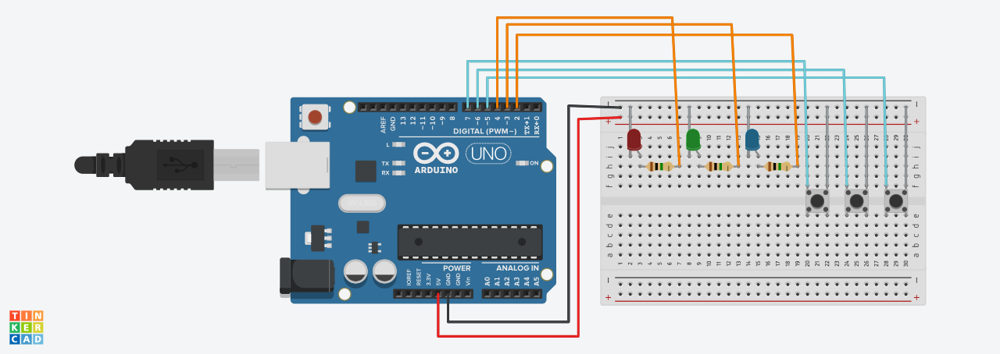
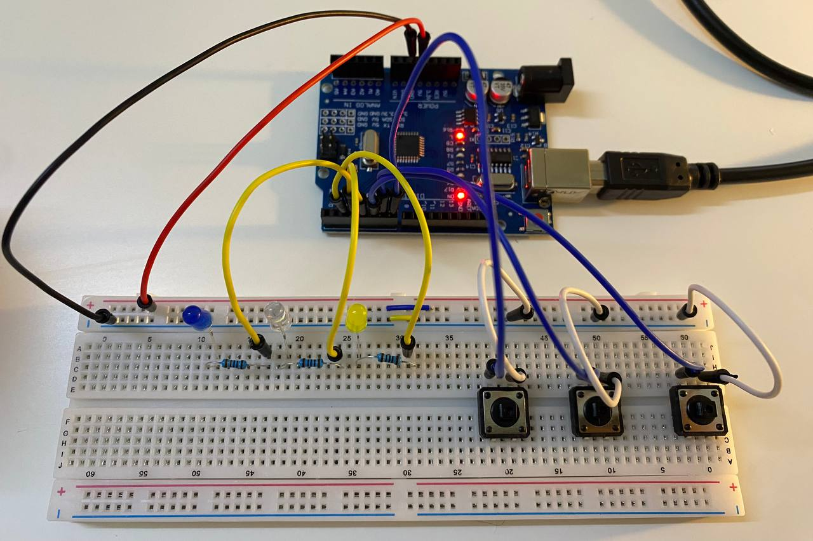

# Arduino LED Buttons Project
A simple Arduino project to control 3 LEDs using 3 push buttons.  
Each button toggles its corresponding LED ON/OFF on every press.

# Components Required
- Arduino UNO (or compatible)
- 3 × LEDs
- 3 × 1000 kΩ resistors
- 3 × Push buttons
- Jumper wires
- Breadboard

# Wiring Guide
| LED | Pin | Button | Pin |
|-----|-----|--------|-----|
| 1   | D2  | 1      | D5  |
| 2   | D3  | 2      | D6  |
| 3   | D4  | 3      | D7  |
- Buttons use `INPUT_PULLUP` and connect to GND.
- LEDs are active HIGH (use 1000 kΩ resistor in series).

# Simulation Wiring (Tinkercad)
This is the circuit layout as designed in Tinkercad:

# Real-life Circuit (Breadboard Setup)
This is an actual photo of the physical setup on a breadboard:

